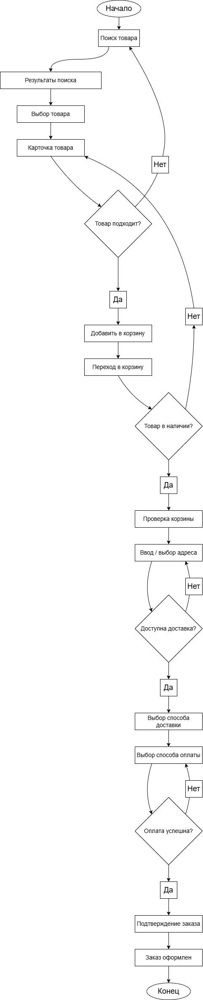

# Процесс оформления заказа

## Основной сценарий

1. Пользователь открывает карточку товара  
2. Добавляет товар в корзину  
3. Переходит в корзину  
4. Проверяет состав заказа  
5. Нажимает "Оформить заказ"  
6. Вводит/подтверждает данные доставки  
7. Выбирает способ оплаты  
8. Подтверждает заказ  

---

## Альтернативные сценарии

### 1. Товар недоступен
→ сообщение об ошибке  
→ предложение аналогов  

### 2. Ошибка оплаты
→ повторная попытка  
→ выбор другого способа  

### 3. Брошенная корзина
→ пользователь уходит  
→ потенциальный ретаргетинг  

---

## Ключевые точки потерь

- после добавления в корзину  
- на этапе ввода данных  
- на этапе оплаты  

👉 Эти точки критичны для оптимизации

# Процесс оформления заказа

